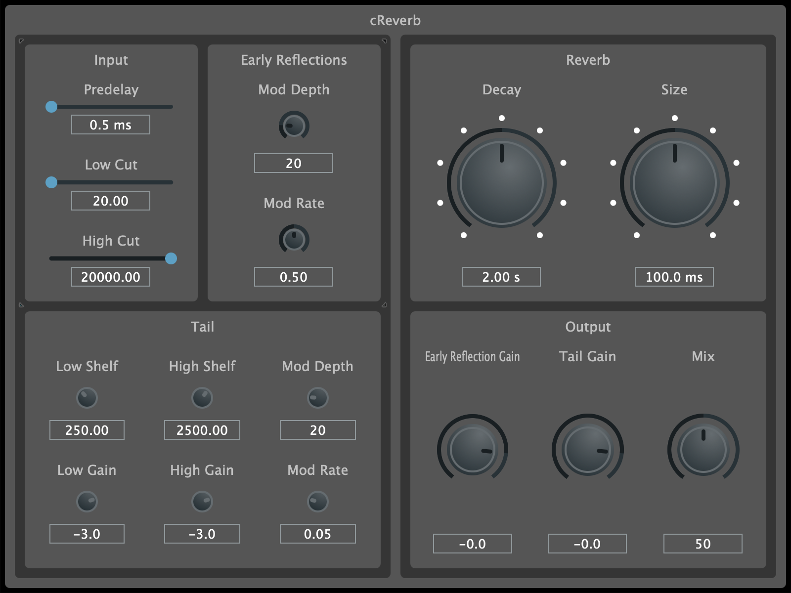

# cReverb

<p align="center"></p>

## Overview

cReverb is a reverb audio effect plugin available in VST3, AU, and CLAP formats for Mac and Windows, built using C++ and JUCE.

This implementation is based on the excellent writeup from [Geraint Luff](https://signalsmith-audio.co.uk/writing/2021/lets-write-a-reverb/).

You can find the actual DSP code for this effect in the [cgo_modules](https://github.com/calgoheen/cgo_modules/tree/main/cgo_processors/effects) repository.

## Build Instructions

### Prerequisites

- [CMake](https://cmake.org/)
- [Ninja](https://ninja-build.org/)

### Build

```
# Clone the repo
git clone --recurse-submodules https://github.com/calgoheen/cReverb.git
cd cReverb

# Configure and build
cmake --preset release
cmake --build --preset release
```

## External Dependencies

- [JUCE](https://github.com/juce-framework/JUCE)
- UI is built with [foleys_gui_magic](https://github.com/ffAudio/foleys_gui_magic)
- DSP modules from [chowdsp_utils](https://github.com/Chowdhury-DSP/chowdsp_utils)
- CLAP plugin format is built with [clap-juce-extensions](https://github.com/free-audio/clap-juce-extensions)
